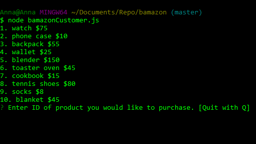
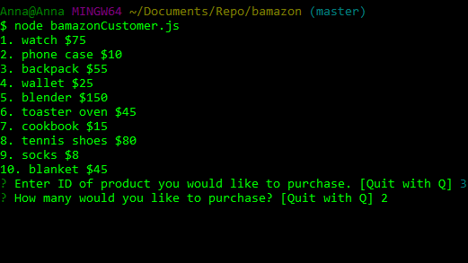
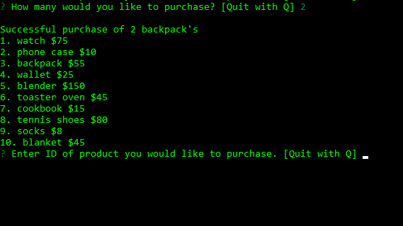
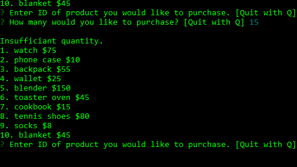

# bamazon
This is a node application that will work as a basic shopping app utilizing a mySQL database contain the inventory and inquirer package to display prompts/messages for the user. 

Displays items available for purchase

Prompt for item to purchase and prompt for amount

Shows a succesful purchase prompt and displays inventory again

Displays unsuccesful purchase due to insufficient amount

